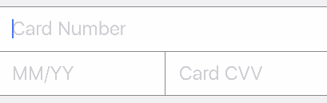

# CreditCardRow

<p align="left">
<a href="https://travis-ci.org/EurekaCommunity/CreditCardRow"></a>

<a href="https://developer.apple.com/swift"></a>
<a href="https://github.com/Carthage/Carthage"></a>
<a href="https://cocoapods.org/pods/CreditCardRow"></a>
<a href="https://raw.githubusercontent.com/xmartlabs/CreditCardRow/master/LICENSE"></a>
</p>

By [Xmartlabs SRL](http://xmartlabs.com).

## Contents
 * [Introduction](#introduction)
 * [Usage](#usage)
 * [Requirements](#requirements)
 * [Getting involved](#getting-involved)
 * [Examples](#examples)
 * [Installation](#installation)
 * [Customization](#customization)
 	* [CreditCardRow parameters](#creditcardrow-parameters)
 	* [Creating custom nib file](#custom-nib)
 	* [Extending or overriding CreditCardCell functionality](#overriding)
 * [Roadmap](#roadmap)

## Introduction

`CreditCardRow` is a custom row for Eureka in which the user will be able to input a credit card, its expiration date and  the CVV/CVC value. It has a default UI design but that [can be easily changed](#customization) to fit (almost) any other design.

 

The master branch is in Swift 4. Use release 1.0.0 for Swift 2 or release 2.* for Swift 3.

## Usage

```swift
import CreditCardRow

class ViewController: FormViewController {

    override func viewDidLoad() {
        super.viewDidLoad()


        // Append the default CreditCardRow and my custom MyCreditCardRow
        form +++ Section()
            <<< CreditCardRow()
    }
}
```

## Requirements

* iOS 8.0+
* Xcode 9.0+

## Getting involved

* If you **want to contribute** please feel free to **submit pull requests**.
* If you **have a feature request** please **open an issue**.
* If you **found a bug** or **need help** please **check older issues**.

Before contribute check the [CONTRIBUTING](https://github.com/xmartlabs/CreditCardRow/blob/master/CONTRIBUTING.md) file for more info.

If you use **CreditCardRow** in your app We would love to hear about it! Drop us a line on [twitter](https://twitter.com/xmartlabs).

## Examples

Follow these steps to run Example project: 
 * Clone CreditCardRow repository
 * Open terminal in the downloaded folder and run carthage update
 * Open CreditCardRow workspace
 * Run the *Example* project.

## Installation

#### CocoaPods

[CocoaPods](https://cocoapods.org/) is a dependency manager for Cocoa projects.

To install CreditCardRow, simply add the following line to your Podfile:

```ruby
pod 'CreditCardRow', '~> 3.0'
```

#### Carthage

[Carthage](https://github.com/Carthage/Carthage) is a simple, decentralized dependency manager for Cocoa.

To install CreditCardRow, simply add the following line to your Cartfile:

```ogdl
github "EurekaCommunity/CreditCardRow" ~> 3.0
```


## Customization

A custom row is not worth much if it is not customisable. Therefore this row aims to be pretty customisable. Ideally you should be able to use all the logic implemented here with a completely different design. You should also be able to easily switch some basic behaviour.

For basic styling like fonts, colors, margins, separators you should use `cellSetup` and `cellUpdate`. For more complex stuff there are other ways to create what you want.

> CreditCardRow includes row navigation so that the user can navigate from one field to the next by tapping a button in the accessoryView of the cell. If you change the order of the text fields then you should also [override the row navigation functionality](#overriding).

### CreditCardRow parameters 

`CreditCardRow` has the following variables that can be used/changed:

* `var numberSeparator: String = " "`: Separator for the credit card number. Supports multi-character strings like " - " for example.
* `var expirationSeparator: Character = "/"`: Separator used between month and year numbers in expiration field.
* `var maxCVVLength: Int = 4`: Maximum length for CVV/CVC field
* `var maxCreditCardNumberLength = 19`: Maximum length for Credit Card number. Credit Card length can be up to 19 after ISO 7812-1. 6 digits IIN, 12 account digits and a check digit.

For example you can do this:

```swift
<<< CreditCardRow() {
      $0.numberSeparator = "-"
      $0.expirationSeparator = "-"
      $0.maxCreditCardNumberLength = 16
      $0.maxCVVLength = 3
  }
```

 


### CreditCardCell parameters:

The `CreditCardCell` has the following variables (all of them are outlets and can be connected from a nib file):

* `var horizontalSeparator: UIView?`: Horizontal separator between number field and expiration and CVV fields in original cell
* `var verticalSeparator: UIView?`: Vertical separator between expiration and CVV fields in original cell
* `var numberField: PaddedTextField!`: Text field for the credit card number
* `var expirationField: PaddedTextField?`: Text field for the expiration date of the credit card. This is an optional variable. You could implement a cell without the `expirationField`
* `var cvvField: PaddedTextField?`: Text field for the CVV value. This text field is also optional.

> PaddedTextField is a UITextField subclass that implements a padding around the text rect of the UITextField. 

`horizontalSeparator` and `verticalSeparator` depend on the default design. You will probably not use them if you create your own design. Also, as `expirationField` and `cvvField` are optional you could create a cell that just contains the credit card number like the following (you can find it in the example project):

 

### Creating custom nib file <a name="custom-nib"></a>

You might want to follow your own design. To accomplish this you should follow these steps:

* Create a user interface xib file and edit it with Xcode's Interface Builder. You should add a simple `UITableViewCell` and say that its class is a `CreditCardCell`. Make sure that the module of that class appears as `CreditCardRow`.
* Add an UITextField for the credit card's number. If you also want then you can add text fields for the expiration date and CVV/CVC value of the credit card.
* Connect these UITextField's to the corresponding outlets in the CreditCardCell.swift file
* Customise how the internal navigation works for these text fields (if you have changed the order of the fields.)
* Specify that you want to use the newly created nib file. You can do this in two ways:
	* Using RowDefaults: use this if you want to use only this custom CreditCardRow in your app.
	
	```swift
	CreditCardRow.defaultRowInitializer = {
            $0.cellProvider = CellProvider<CreditCardCell>(nibName: "CustomCell", bundle: nil)
        }
	```
	
	* Or create a custom row subclassing `_CreditCardRow`:
	
	```swift
	final class MyCreditCardRow: _CreditCardRow, RowType {
	    required init(tag: String?) {
	        super.init(tag: tag)
	        cellProvider = CellProvider<CreditCardCell>(nibName: "CustomCell", bundle: nil)
	    }
	}
	```

### Extending or overriding CreditCardCell functionality <a name="overriding"></a>

Sometimes it is not enough to create a custom nib file; you also need to subclass and change some functionality. An example of this is if you change the order in which the text fields appear to the user or you remove the `expirationField` or the `cvvField` and you want to change the row navigation. In that case you should start by creating a class that subclasses `CreditCardCell` and that overrides `inputAccessoryView`:

```swift
class MyCreditCardCell: CreditCardCell {
    override var inputAccessoryView: UIView? {
        // customize the accessoryView. Have a look at its superclass's implementation
        return super.inputAccessoryView
    }
}
```

You should be able to change any behaviour by overriding some method or variable.

To use this `MyCreditCardCell`, you will have to specify in your nib file that you are using this class and you must change the `cellProvider` of `CreditCardRow` to use your custom nib file (as you should have already done if you read the previous section).

## Author

* [Mathias Claassen](https://github.com/mats-claassen) ([@mClaassen26](https://twitter.com/mClaassen26))

## What is on the roadmap?

What could be added to CreditCardRow:

* Implement some Eureka Validation
	* Add SwiftLuhn validation

# Change Log

This can be found in the [CHANGELOG.md](CHANGELOG.md) file.
